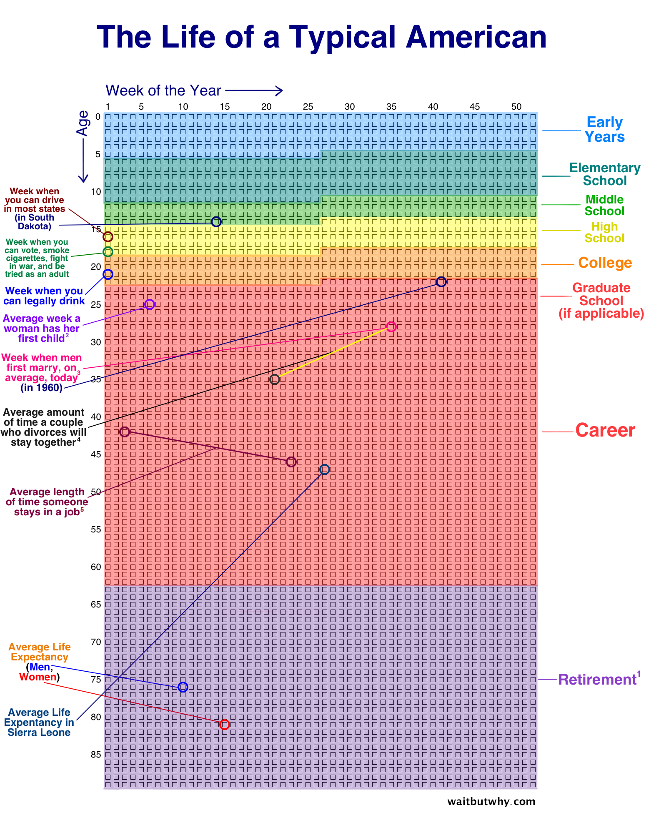
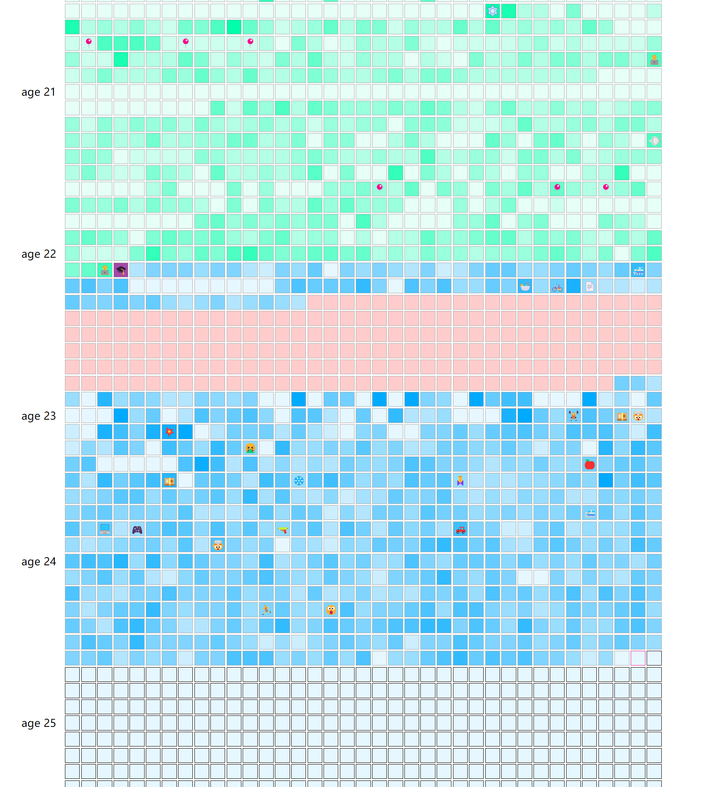
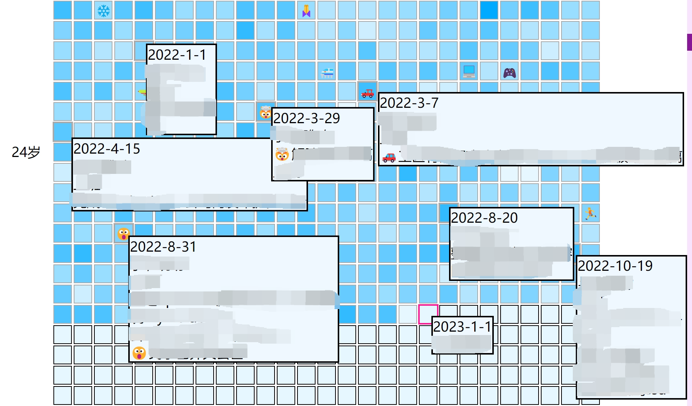

# Life Calendar

An implementation of the ideas in post [Your Life in Weeks](https://waitbutwhy.com/2014/05/life-weeks.html). Allows you to log everyday events and assign a credit to each day. Mark your life periods with different hues and higher credit brings thicker color. This is basically a daliy and enhanced version of the image below:

Sample Site: [Life Calendar](https://ssine.ink/LifeCalendar/) (Just a github page of this repo). You'll need to find a way to update the events.html daily yourself. Screenshots:

For more details, see [my blog](https://ssine.ink/posts/life-calendar).

Features:

- mark periods with different hues
- new periods and events override old ones
- custom box color
- display emoji in box

TODO:

- extract birthday to data
- better data format (schema, HTML -> jsonl/yaml/etc)
- easier deployment
- random motto?
